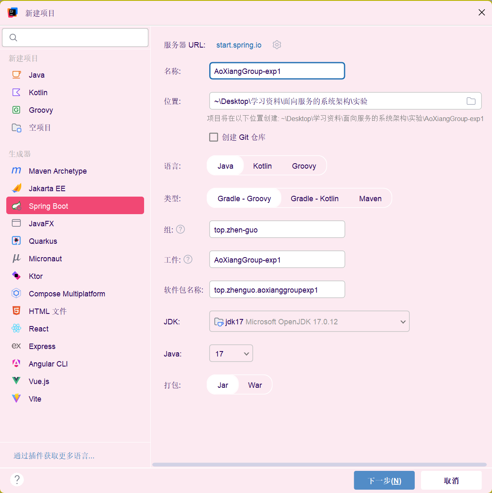
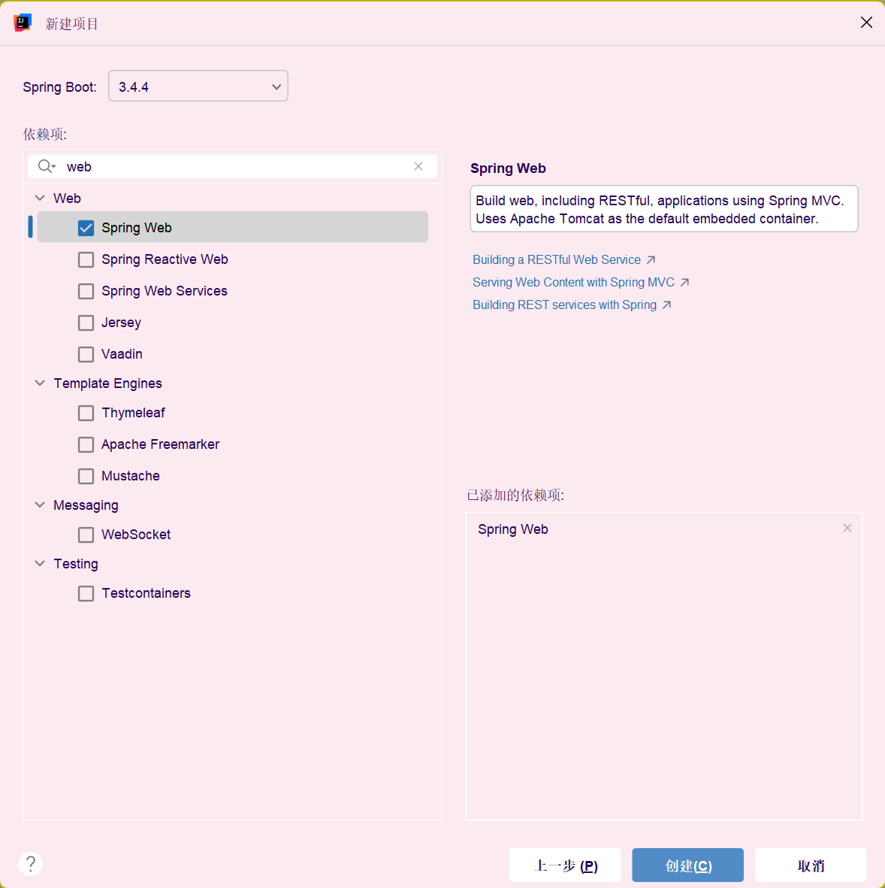

# 实验一 初识 Spring Boot
Spring Boot 是由 Spring 团队提供的一个全新框架，其设计目的是为了简化 Spring 应用的初始搭建过程和开发过程。请同学们根据课程内容，分组进行 Spring Boot 项目的快速构建。 本实验预期目标分为：

1. 请简述 Spring Boot 的执行流程；
2. 通过代码生成器 Spring Initializer 构建名字为 GroupX X 为小组编号） 的 Spring Boot 项目；
3. 编写 Spring Boot 项目控制层订单控制类 OrderController ，并在其中输出“ Hello Order ”提示
4. 启动 Spring Boot 项目，并对启动结果进行截图。


## 简述执行流程

Spring Boot 的执行流程可以分为几个关键步骤，从启动应用程序到处理请求并返回响应。以下是简要的执行流程：

### 1. 启动应用程序
- **启动类**：Spring Boot 应用程序通常从一个带有 `@SpringBootApplication` 注解的主类开始。
- **SpringApplication.run()**：调用 `SpringApplication.run(YourApplicationClass.class, args)` 方法启动应用程序。

### 2. 创建 Spring 应用上下文
- **ApplicationContext**：Spring Boot 创建一个 `ApplicationContext`，这是 Spring 应用的核心，负责管理所有 Spring 管理的 Bean。
- **组件扫描**：Spring Boot 会自动扫描主类所在包及其子包中的组件（如 `@Component`, `@Service`, `@Repository`, `@Controller` 等）。

### 3. 加载配置
- **配置文件**：Spring Boot 加载配置文件（如 `application.properties` 或 `application.yml`），这些文件中的配置项会被加载到 `Environment` 中。
- **外部化配置**：支持多种外部化配置方式，包括命令行参数、环境变量、系统属性等。

### 4. 创建和配置 Bean
- **Bean 定义**：Spring Boot 根据组件扫描和配置文件中的信息，创建 Bean 定义。
- **Bean 实例化**：Spring 容器实例化这些 Bean，并进行依赖注入。

### 5. 启动嵌入式服务器
- **嵌入式服务器**：Spring Boot 默认使用嵌入式 Tomcat 服务器（也可以配置为 Jetty 或 Undertow）。
- **Web 应用上下文**：创建 `WebApplicationContext`，这是 `ApplicationContext` 的子类，专门用于 Web 应用。

### 6. 处理请求
- **请求映射**：Spring MVC 处理 HTTP 请求，根据请求路径和方法映射到相应的控制器方法。
- **控制器方法**：控制器方法处理请求并返回响应。
- **视图解析**：如果返回的是视图名称，Spring MVC 会解析视图并生成响应内容。

### 7. 返回响应
- **响应生成**：Spring MVC 将控制器方法的返回值转换为 HTTP 响应，并发送给客户端。

### 8. 应用程序运行
- **持续运行**：Spring Boot 应用程序持续运行，等待新的请求。

### 9. 关闭应用程序
- **优雅关闭**：当应用程序需要关闭时，Spring Boot 会优雅地关闭所有资源，包括嵌入式服务器和 Bean。

### 总结
Spring Boot 的执行流程从启动类开始，经过创建应用上下文、加载配置、创建和配置 Bean、启动嵌入式服务器，最终处理请求并返回响应。整个过程由 Spring 容器管理和协调，确保应用程序的各个组件协同工作。


## 创建项目





## 编写 Spring Boot 项目控制层订单控制类 OrderController ，并在其中输出“ Hello Order ”提示

```java
package top.zhenguo.exp1;

import org.springframework.web.bind.annotation.GetMapping;
import org.springframework.web.bind.annotation.RequestMapping;
import org.springframework.web.bind.annotation.RestController;

@RestController
@RequestMapping("/order")
public class OrderController {
    @GetMapping("")
    public String order() {
        return "Hello Order";
    }
}
```

